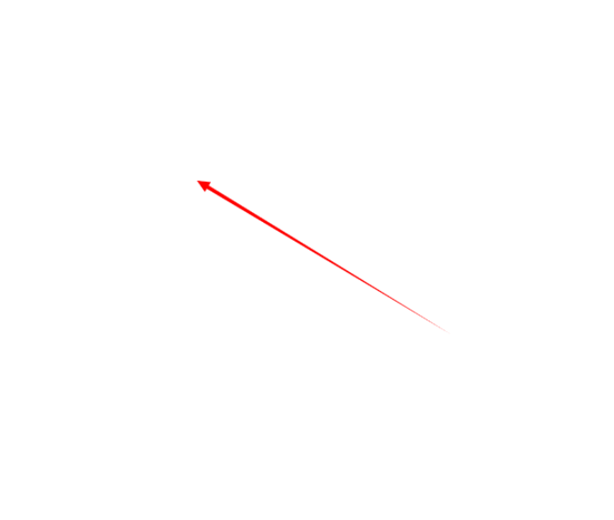

# canvas-draw-mousemove-arrow
`Open the index.html file with your browser (Google*)`

<h3>这是一个用于canvas的画图方法，当鼠标按下去的时候拖拽他会有一个箭头出来，一般常用于图片编辑的指向箭头</h3>
<h3>This is a drawing method for canvas. When the mouse is pressed down, dragging it will bring out an arrow, which is commonly used for pointing arrows in picture editing</h3>

